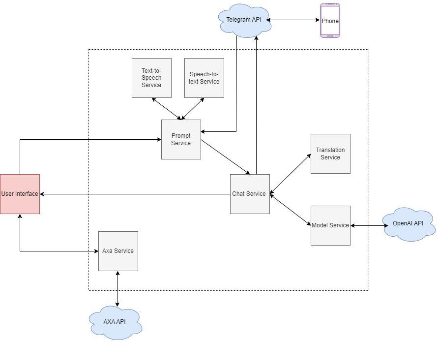

# Simplifying Complex Documents With A Natural Language Processing Chatbot.

* Status: accepted 
* Deciders: Kwame Adu - Poku Sarfo, Judith Serwaa Ofosu, Elvis Segbawu, Afsanat Ineza
* Date: 2023-05-05

## Context and Problem Statement
Our goal is to create a solution that simplifies interacting with, and understanding complex documents. The solution should make sure the true meaning and intent of the original document is not lost.

## Decision Drivers <!-- optional -->

* A user with disability, who wants to consume documents.
* A company, that wants to increase compliance with relevant requirements.
* A user, who wants to save time and increase their efficiency.

## Considered Options

* An accessibility tool that converts complex documents into alternative formats such as audio or braille.
* A Natural Language Processing chatbot that allows users to submit complex documents, receive a short summary of the document, and ask questions.
* A tool that summarizes complex documents and provides a short summary to users. Users can then ask questions on the summary.

## Options Decision Outcome

Chosen option: "A Natural Language Processing chatbot that allows users to submit complex documents, receive a short summary of the document and be able to ask questions", because it will let users have a better understanding of the documents they are interacting with, as well as provide a personalized experience.

### Architectural Diagram

### Positive Consequences:

- Increased accessibility to information for people with disabilities, leading to greater inclusion and equity.
- Easy-to-understand explanations of complex documents leading to increased compliance to requirements that may be included in documents.
- Ability to access solution through the web and also a messaging app.

### Negative Consequences:

- Technical limitations of the NLP chatbot, such as  misunderstandings, could lead to frustration or confusion for users.

## Pros and Cons of the Options

1. Option 1:

Pros:
- Can improve accessibility for users with disabilities, allowing them to access documents in alternative formats.
- Can improve compliance for companies by ensuring that users with disabilities have equal access to important documents.
- Can be a cost-effective way to improve accessibility compared to other options, such as hiring interpreters or producing braille documents.

Cons:
- May not provide the level of detail that some users require, potentially leading to confusion or misunderstandings.
- May not be suitable for all types of disabilities, as some users may require specific accommodations beyond alternative formats.
- May require significant development and maintenance to ensure that the alternative formats are accurate and effective.

&nbsp;

2. Option 2:

Pros:
- Can improve accessibility for users with disabilities who may struggle with traditional text-based documents.
- Provides a personalized experience for users, allowing them to ask questions and receive answers in a conversational manner.
- Can improve efficiency for users who need to interact with complex documents on a regular basis.
- Can improve compliance for companies by ensuring that users have a better understanding of the documents they are interacting with.

Cons:
- Can be resource intensive to develop and maintain.
- May not be able to provide answers to all questions, depending on the level of complexity and nuance involved.

&nbsp;

3. Option 3:

Pros:
- Can improve accessibility for users with disabilities by providing summaries in alternative formats.
- Can improve efficiency for users who need to quickly understand the key points of a complex document.
- Can be more cost-effective than developing a chatbot, as it may not require as much advanced hardware.
- Can potentially improve compliance for companies by ensuring that users have a better understanding of the documents they are interacting with.

Cons:
- May not provide the level of detail that some users require, potentially leading to confusion or misunderstandings.
- May not be suitable for all types of documents, especially those that are highly technical or require a high level of nuance.
- May require significant development and maintenance to ensure that the summarization algorithms are accurate and effective.

## Proposed Design

* An intuitive and easy to use user interface, with clear instructions and guidance on how to upload and interact with documents. 
* Document processing with advanced Natural Language Processing(NLP) models.
* Question answering that allows users to ask questions about the document using natural language queries.
* Accessibility features such as speech-to-text and text-to-speech.

## Considerations

* Quality and accuracy of the Natural Language Processing models
* Availability, licensing, and or cost of the models
* Technical requirements to use the models.

## Design Decisions

* Use of an open source embedding model (all-mpnet-base-v2
) and the GPT-3 language model, both trained on extensive datasets for our use case to ensure quality and accuracy
* Use of the open source embedding model (all-mpnet-base-v2
), from our tests and analysis, will reduce operational costs by 91%
* Due to hardware limitations, use of a paid large language model, accounting for 8% of total operational costs